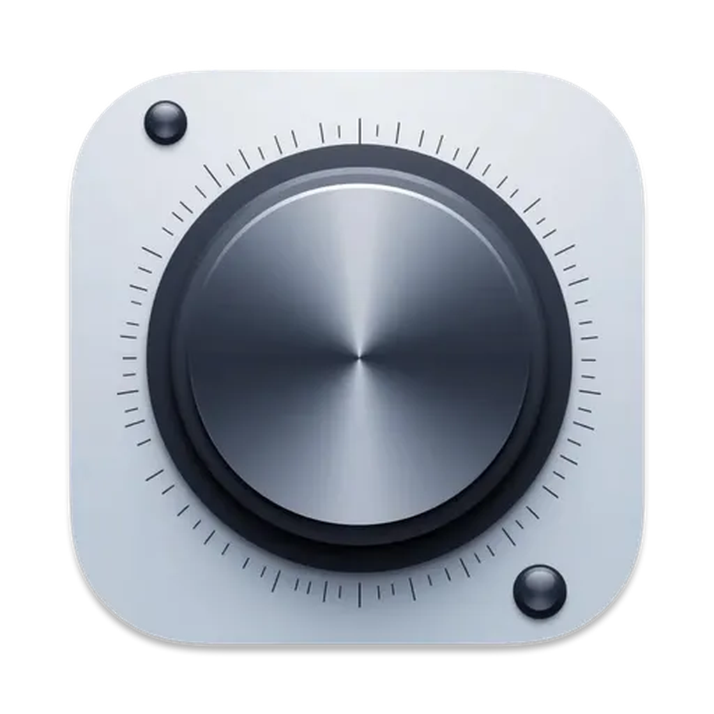
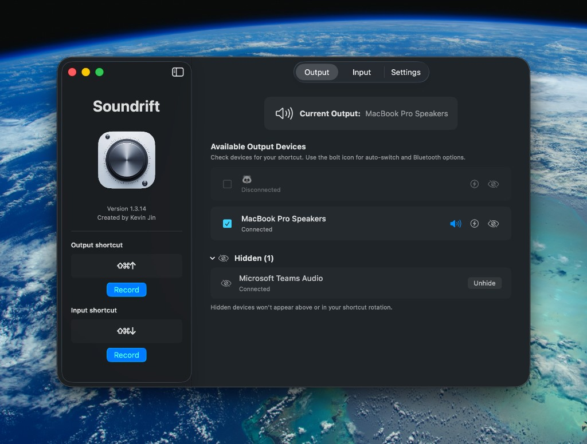

# Soundrift

**Soundrift** is a lightweight macOS menu bar utility for switching audio input and output devices with a global keyboard shortcut.

[](#requirements)
[](https://github.com/skndmx/TripleS/releases/latest)
[](LICENSE)
[](https://github.com/skndmx/TripleS/releases)

<p align="center">
  
</p>

<p align="center">
  
</p>

## Why Soundrift?

macOS makes it easy to *change* the default audio device — and tedious to do it often. Soundrift keeps your preferred devices in a short list and lets you cycle them instantly from the keyboard, without opening System Settings.

Built for people who hop between headphones, speakers, and mics all day — including work Macs where Continuity / Apple ID isn’t available.

## Features

| | |
|---|---|
| **Global shortcuts** | Separate hotkeys for output and input rotation |
| **Menu bar app** | Stays out of the way; close the window to hide the Dock icon |
| **Hide clutter** | Tuck away virtual devices (Teams Audio, etc.) |
| **Auto-switch** | Jump to a device the moment it connects |
| **Bluetooth reconnect** | Optionally retry connecting paired AirPods / headsets |
| **Launch at login** | Ready when you are |

## Install

1. Download the latest **`.dmg`** from [Releases](https://github.com/skndmx/TripleS/releases/latest)
2. Open the disk image and drag **Soundrift** into **Applications**
3. Launch Soundrift — look for the headphones icon in the menu bar

### Gatekeeper note

Current releases are **ad-hoc signed** (not notarized). If macOS says the app is damaged or blocked:

```bash
xattr -cr /Applications/Soundrift.app
```

Then right-click the app → **Open**.

## Quick start

1. Open **Show Main Window** from the menu bar icon  
2. Check the devices you want in your rotation (Output / Input tabs)  
3. Record shortcuts in the left sidebar  
4. Press the shortcut to switch — a notification confirms the active device  

**Tips**

- Bolt icon on a row → auto-switch and/or Bluetooth auto-reconnect  
- Eye icon → hide a device; restore it from **Hidden**  
- **⌘W** (or the red close button) → back to menu-bar-only mode  
- Quit from the menu bar when you want Soundrift fully exited  

## Requirements

- macOS **26** or later  
- Bundle ID: `com.kevinjin.Soundrift`

## Building from source

```bash
git clone https://github.com/skndmx/TripleS.git
cd TripleS
open TripleS.xcodeproj
```

Run the **TripleS** scheme in Xcode (product name: **Soundrift**).

```bash
# Optional: local DMG
./scripts/create-dmg.sh
# → dist/Soundrift-<version>.<build>.dmg
```

## Contributing

Issues and pull requests are welcome. For bugs, include your macOS version and a short description of the audio setup (built-in / Bluetooth / virtual devices).

## License

This project is licensed under the [MIT License](LICENSE).

---

Made by [Kevin Jin](https://github.com/skndmx)
